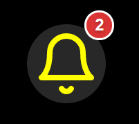
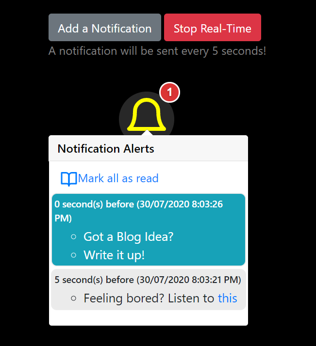

# 🔔 react-notification-timeline
<!-- ALL-CONTRIBUTORS-BADGE:START - Do not remove or modify this section -->
[](#contributors-)
<!-- ALL-CONTRIBUTORS-BADGE:END -->
`react-notification-timeline` is a [reactjs](https://reactjs.org/) based component helps in managing the notifications in time-based manner. It is capable of keep tracking of the incoming notifications, manage read vs unread messages and allows many more customizations.

# 🔥 Why do you need this?
- 👉 Is your project is based on react js and you are looking for a time-based notification system? 
- 👉 Do you want to keep track of the notifications in timed manner and manage them ? 
- 👉 Do you want to structure the notifications in a cleaner way?
- 👉 Do you want to manage multi-line notifications?
- 👉 Do you limit the number of notifications you may want to see?

Then, you should give `react-notification-timeline` a try. 

## Here are some screen-shots
- Notification Componet with the unread message count

  
 
- Notification Componet with the messages as a pop-over

 

## Live Demo
[](https://app.netlify.com/sites/notify-timeline/deploys) 

A Live demo of the component is available here, [💻 CLICK FOR DEMO](https://notify-timeline.netlify.app/) 

# ⚒️ How to use?

## Install
You can install `react-notification-timeline` using `npm` or `yarn`.

```shell
npm i react-notification-timeline
```

```yarn
yarn add react-notification-timeline
```

## Import
Once installed, it can be imported into a react component as,

```js
import NotifyMe from 'react-notification-timeline';
```

## Usage
Here is an example usage,

```js
<NotifyMe
  data={data}
  storageKey='notific_key'
  notific_key='timestamp'
  notific_value='update'
  heading='Notification Alerts'
  sortedByKey={false}
  showDate={true}
  size={64}
  color="yellow"
/>
```

### Properties
<details><summary>CLICK ME to know the details of the properties</summary>
<p>

<table>
  <tr>
    <td> <b>Property</b> </td> 
    <td> <b>Description</b> </td>
    <td> <b>Required</b> </td>
    <td> <b>Example</b> </td>
  </tr>

  <tr>
    <td> color </td>
    <td> Color of the notification bell. Pass a color to customize it.</td>
    <td> No </td>
    <td> Color in Hexacode, rgb or string name. Default value is, <b>#FFFFFF</b></td>
  </tr>
  
  <tr>
    <td> data </td>
    <td> 
      Messages to show as notifications. This is expected to be an array of objects. Each of the object must have two properties.
      <ul>
        <li><b>timestamp:</b> The timestamp of the time a message was generated. This must be a of a type long and represent a timestamp.</li>
        <li><b>update:</b> The message to show as notification.</li>
      </ul>
      Note: The keys names, timestamp and update can be customized as explained in other properties below.
    </td>
    <td> Yes </td>
    <td>
      
   ```js
      [
        {
          "update":"70 new employees are shifted",
          "timestamp":1596119688264
        },
        {
          "update":"Time to take a Break, TADA!!!",
          "timestamp":1596119686811
        }
      ]
   ```
   
   </td>
  </tr>
  
  <tr>
    <td> heading </td>
    <td> A header message for the Notification panel. Pass a message to customize it.</td>
    <td> No </td>
  <td> Any string of your choice. Default value is, <b>Notifications</b> </td>
  </tr>
  
  <tr>
    <td> multiLineSplitter </td>
    <td> In case a notification message has to be splitted into multiple (bullet) items, you can specify a line splitter character in-between. </td>
    <td> No </td>
    <td> Any Character like, # or a sequence of characters, #$#. Default value is, <b>\n</b></td>
  </tr>
    
  <tr>
    <td> notific_key </td>
    <td> Key in the data property that holds the timestamp value. </td>
    <td> Yes </td>
  <td> <b>timestamp</b>, <b>attime</b> or any string based key name in the data property.</td>
  </tr>
  
  <tr>
    <td> notific_value </td>
    <td> key in the data property that holds the notification message value. </td>
    <td> Yes </td>
    <td> <b>update</b>, <b>message</b> or any string based key name in the data property.</td>
  </tr>
  
  <tr>
    <td> showDate </td>
    <td> Notification message shows the date and time along with the message. Pass false for this property, if you do not want to show it. Pass true otherwise. </td>
    <td> No </td>
    <td> true or false. Default value is, <b>false</b></td>
  </tr>
  
  <tr>
    <td> size </td>
    <td> Size of the notification bell. Pass a Size to customize it.</td>
    <td> No </td>
    <td> Size values as, 16, 32, 48 etc. Default value is, <b>32</b></td>
  </tr>
  
  <tr>
    <td> sortedByKey </td>
    <td> Pass true, if the data passed to this component is already sorted by time-based key. Pass false otherwise, the component will take care of the time based sorting. </td>
    <td> No </td>
    <td> true or false. Default value is, <b>true</b></td>
  </tr>
  
  <tr>
    <td> storageKey </td>
    <td> It stores the last read message key in localstorage of the browser.</td>
    <td> No </td>
    <td> Any string of your choice as a key. Default value is, <b>notification_timeline_storage_id</b></td>
  </tr>
</table>

</p>
</details>


# 🏷️ License
Copyright © 2020 by [Tapas Adhikary](https://tapasadhikary.com/)

This project is licensed under MIT license.

# ⭐ Show your support
If you liked the work, please show your support by giving a Star!

# ✋ Contributions
I would love to get your feedback. Please use the github issues for submitting any feedback. At the same time, please join hands in improving the component further by fixing bugs, adding features.

People contributed so far ([emoji key](https://allcontributors.org/docs/en/emoji-key)):

<!-- ALL-CONTRIBUTORS-LIST:START - Do not remove or modify this section -->
<!-- prettier-ignore-start -->
<!-- markdownlint-disable -->
<table>
  <tr>
    <td align="center"><a href="https://tapasadhikary.com"><br /><sub><b>Tapas Adhikary</b></sub></a><br /><a href="#infra-atapas" title="Infrastructure (Hosting, Build-Tools, etc)">🚇</a> <a href="https://github.com/atapas/notifyme/commits?author=atapas" title="Tests">⚠️</a> <a href="https://github.com/atapas/notifyme/commits?author=atapas" title="Code">💻</a></td>
  </tr>
</table>

<!-- markdownlint-enable -->
<!-- prettier-ignore-end -->
<!-- ALL-CONTRIBUTORS-LIST:END -->

This project follows the [all-contributors](https://github.com/all-contributors/all-contributors) specification. Contributions of any kind welcome!
